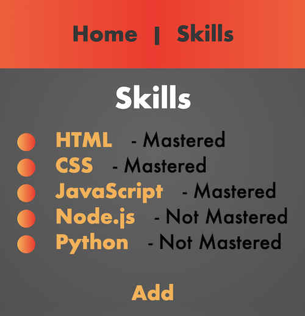
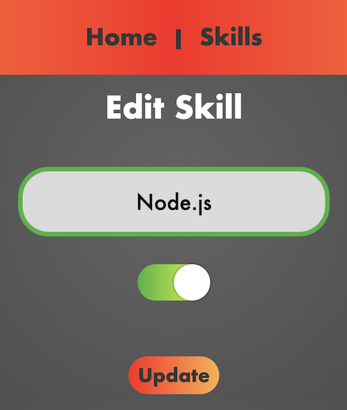

# **Dev Skills Tracker**

### Date: 2/20/2020

#### By: Michael Lackey
#### [Website](https://michaellackey.com/) | [GitHub](https://github.com/mlackey9601) | [LinkedIn](https://www.linkedin.com/in/michaelglackey/) | [GA Profile](https://profiles.generalassemb.ly/michaellackey)
***

### ***Description***

##### A simple list app for tracking developer skills.
***

### ***Technologies Used***

***

### ***Getting Started***

##### Use this website to keep track of your learned developer skills. Skills can be added to the list, removed, and edited.  Use the nav bar on top to move easily throughout the views.
##### The project was deployed on Heroku and can be viewed [here](https://express-dev-skills.herokuapp.com/).
***

### ***Screenshots***

###### Skills List

###### View a Skill

###### Edit a Skill

***

### ***Future Updates***

- [x] ~~Add the ability to edit existing items~~
- [x] ~~Add the ability to toggle/untoggle items as mastered~~
- [ ] Create a more organized and clean looking skills list
- [ ] Add sounds that play when list items are removed and/or marked as mastered
- [ ] Add JavaScript animations for the list items
***
